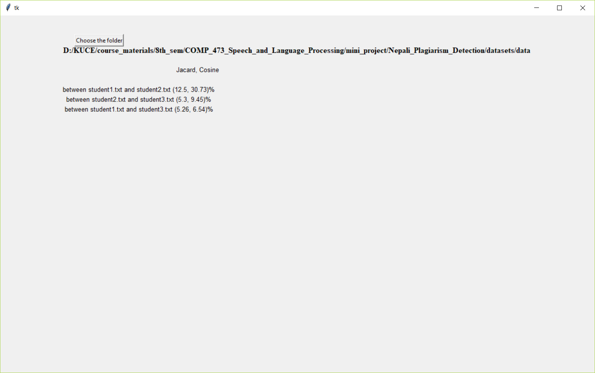

# Nepali_Plagiarism_Detection
An application which detects plagiarised Devanagari text files using a self built rule based stemming algorithm and Cosine similarity.

## Files info

### To run the interface:
Just run the main interface file i.e. main.py or main.ipynb which allows to choose a folder containing the documents and detects plagiarism percentage among them.

### Step by step demonstartaion
The step by step process is demonstrated in detail in the file "Calculating_similarity_between_texts_Nepali.ipynb"

## Interface

## Useful links for Nepali Plagiarism Detection

https://towardsdatascience.com/overview-of-text-similarity-metrics-3397c4601f50

https://medium.com/@adriensieg/text-similarities-da019229c894

https://stackoverflow.com/questions/8897593/how-to-compute-the-similarity-between-two-text-documents

http://mkusner.github.io/publications/WMD.pdf

http://text2vec.org/similarity.html

https://pdfs.semanticscholar.org/5b5c/a878c534aee3882a038ef9e82f46e102131b.pdf

https://blogs.oracle.com/meena/finding-similarity-between-text-documents

https://sites.temple.edu/tudsc/2017/03/30/measuring-similarity-between-texts-in-python/

### Hindi tokenizer
https://github.com/taranjeet/hindi-tokenizer

### Nepali text preprocessing
http://159.203.189.74/pre-processing/

https://www.academia.edu/36298067/Nepali_News_Classification_using_Na%C3%AFve_Bayes_Support_Vector_Machines_and_Neural_Networks

https://www.researchgate.net/publication/271285232_A_Hybrid_Algorithm_for_Stemming_of_Nepali_Text

http://ww.panl10n.net/english/final%20reports/pdf%20files/Nepal/NEP06.pdf (Stemming)

https://pdfs.semanticscholar.org/bd9c/b79102a9a7177fa925d0aa3dfdbff4405ebc.pdf (Stemming)
